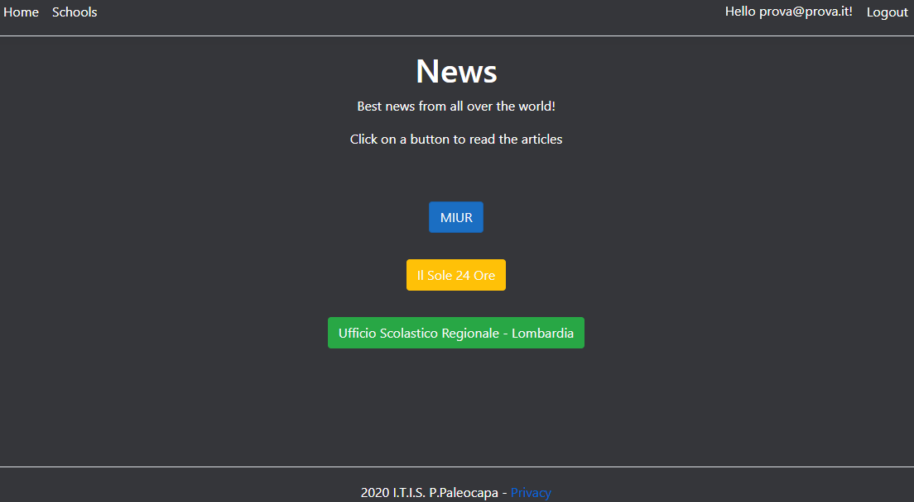
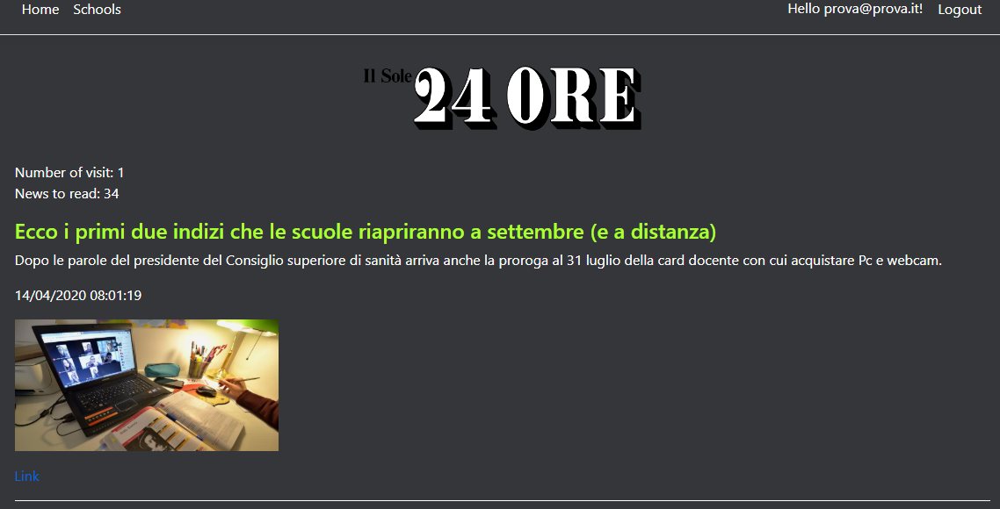
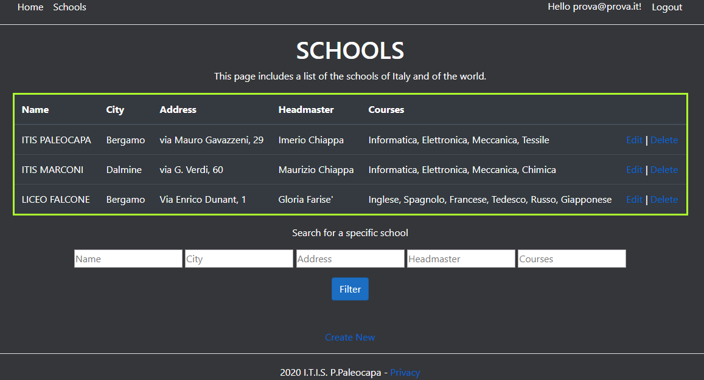

# IstitutiNews
A school project that uses **CRUD** operations and **ASP.NET Core Identity**

* You can choose to read articles about schools from 3 different sources: *MIUR*, *Il Sole 24 Ore* and *Ufficio Scolastico Regionale per la Lombardia*.
  

*The **Home Page***

---

* There are also the number of visits during the session and the number of articles displayed. News are taken using a **Feed Rss reader**.

*The page of **Il Sole 24 Ore***

---

* The section of **Schools** contains a database (a list of some schools) and the **CRUD** operations.
*Create, Update and Delete* are accessible only by registered users.

*The **Index** page of the **Schools** section.*
