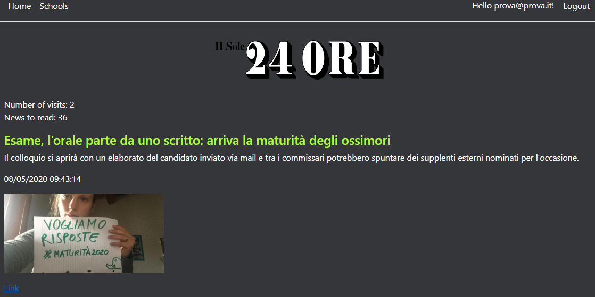

# IstitutiNews
A school project that uses **CRUD** operations and **ASP.NET Core Identity**

This is the **Home Page**, you can choose to read articles about schools from 3 different sources: *MIUR*, *Il Sole 24 Ore* and *Ufficio Scolastico Regionale per la Lombardia*.

This is the page of *Il Sole 24 Ore*. There are also the number of visits during the session and the number of 
articles displayed.

The section of **Schools** contains a db (a list of some schools) and the **CRUD** operations.
*Create, Update and Delete* are accessible only by registered users.

